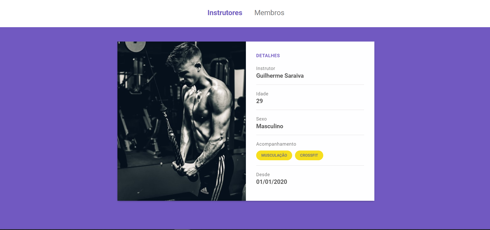

<div align="center">
    <h1> Gym Manager </h1>
</div>




# Table of Contents
- [About](#-about)
- [Technologies](#-technologies)
<!-- - [Installation](#-installation) -->

---

## 📝 About
Here you can manage your gym instructors and members informations. This project was developed during the ***Launchbase Bootcamp*** by [Rocketseat](https://rocketseat.com.br).

---

## 🚀 Technologies
The project was developed with the following technologies: 

- HTML
- CSS
- JavaScript
- Node.js
- Nunjucks

---
<!-- 
## 👇 Installation
```bash
    # Clone the repository
    $ git clone https://github.com/joaobrosin/rentbooks

    # Enter directory
    $ cd rentbooks

    # Install the dependencies
    $ yarn install

    # Start the project
    $ yarn start
```
--- -->

Made with 💙 by ***João Brosin***.